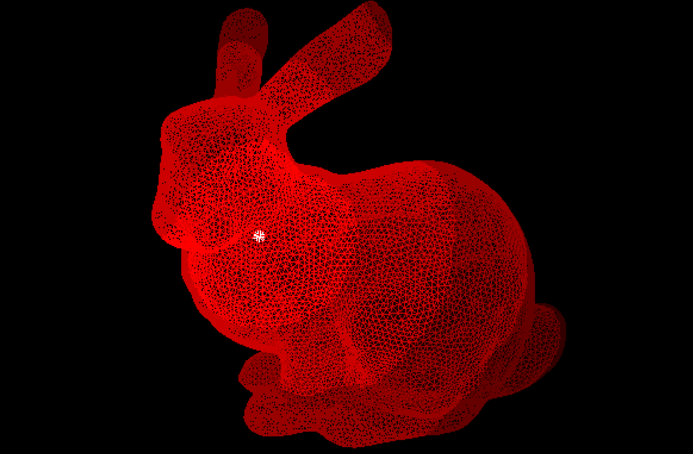

# Geodesic Distance
In Euclidean space, the shortest distance between two points is a straight line. A geodesic is a generalization of straight lines extended to curved spaces such as surface meshes. This repo implements the Heat Method by Crane et al. to compute geodesic distances in an efficient and robust manner on triangle meshes. This algorithm can be extended to other geometric discretization such as regular grids and point clouds. 

Note: Requires Eigen 3.2.4 and assumes it is in /usr/local/Cellar/eigen/3.2.4/include/eigen3/
